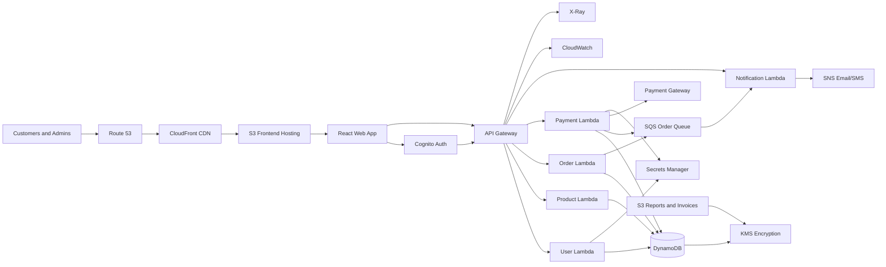
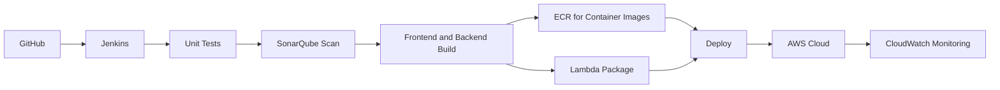

# EquiCart Project Presentation Architecture

## Slide 1: Title

**EquiCart - Cloud-Native Smart Retail and Order Management Platform**

EquiCart is a serverless retail platform for product browsing, cart management, order placement, payment processing, notifications, and admin operations.

## Slide 2: Problem Statement

Retail applications need to support:

- High customer traffic during sales.
- Secure customer and admin access.
- Fast product catalog browsing.
- Reliable order and payment processing.
- Real-time notifications.
- Low operational cost and easy scaling.

## Slide 3: Solution Overview

EquiCart solves this with a cloud-native AWS architecture:

- React frontend hosted on S3 and CloudFront.
- Cognito-based authentication.
- API Gateway as a secure backend entry point.
- Lambda-based microservices.
- DynamoDB and S3 for managed storage.
- SQS and SNS for asynchronous workflows.
- CloudWatch and X-Ray for monitoring and tracing.

## Slide 4: High-Level Architecture

## Slide 5: Frontend Layer

- Users open the application using a custom domain managed by Route 53.
- CloudFront caches static assets close to users.
- S3 stores the React production build.
- The frontend calls API Gateway using the configured API base URL.

## Slide 6: Authentication and Authorization

- Amazon Cognito manages sign-up, sign-in, and JWT tokens.
- Customer and admin access are separated through groups or roles.
- API Gateway validates tokens before backend invocation.
- IAM roles enforce least-privilege service access.

## Slide 7: Backend Microservices

| Service | Responsibility |
| --- | --- |
| User Service | Profile, roles, identity metadata |
| Product Service | Catalog, categories, inventory |
| Order Service | Order placement, order history, tracking |
| Payment Service | Payment request, invoice generation, payment status |
| Notification Service | Email, SMS, alerts |

Each service is independently deployable and can scale based on demand.

## Slide 8: Serverless and Messaging Layer

- API Gateway handles HTTP routing.
- Lambda functions run backend service logic.
- SQS queues decouple order, payment, and notification processing.
- SNS publishes email/SMS notifications.
- This avoids blocking checkout while long-running tasks complete.

## Slide 9: Data Layer

- DynamoDB stores product, order, payment, and profile data.
- S3 stores invoices, reports, backups, and documents.
- Aurora Serverless/RDS can be used for relational reporting if SQL queries are required.
- KMS encrypts sensitive storage.

## Slide 10: Security

- Cognito protects user identity.
- IAM roles restrict each service to only required resources.
- KMS encrypts data at rest.
- Secrets Manager stores payment gateway and database credentials.
- AWS WAF protects public endpoints from common web attacks.

## Slide 11: Monitoring and Observability

- CloudWatch captures logs, metrics, and alarms.
- X-Ray provides distributed tracing across API Gateway and Lambda.
- Key metrics include API latency, Lambda errors, queue depth, payment failures, and order creation rate.

## Slide 12: CI/CD Pipeline

## Slide 13: Why This Architecture Is Cloud-Native

- Uses managed services instead of self-managed servers.
- Scales automatically with traffic.
- Separates services by business capability.
- Uses event-driven messaging for reliability.
- Provides built-in security, monitoring, and tracing.
- Supports independent deployments.

## Slide 14: Benefits

- Lower infrastructure management.
- High availability through AWS managed services.
- Faster customer experience with CDN caching.
- Secure access control.
- Reliable order and payment workflow.
- Better visibility into failures and performance.

## Slide 15: Future Enhancements

- Add DynamoDB Streams for inventory events.
- Add OpenSearch for product search.
- Add Step Functions for order workflow orchestration.
- Add AWS Bedrock-based recommendation features.
- Add blue/green deployment through CodeDeploy.
